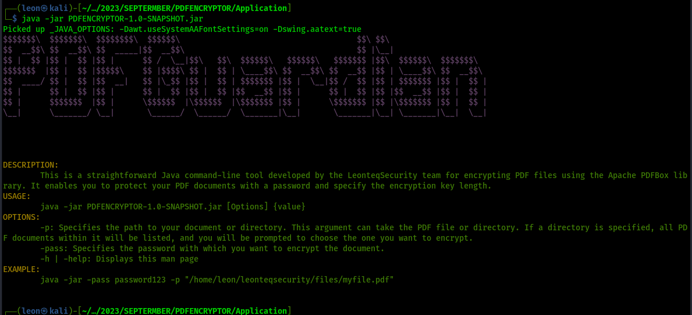

```
$$$$$$$\  $$$$$$$\  $$$$$$$$\  $$$$$$\                                      $$\ $$\                     
$$  __$$\ $$  __$$\ $$  _____|$$  __$$\                                     $$ |\__|                    
$$ |  $$ |$$ |  $$ |$$ |      $$ /  \__|$$\   $$\  $$$$$$\   $$$$$$\   $$$$$$$ |$$\  $$$$$$\  $$$$$$$\  
$$$$$$$  |$$ |  $$ |$$$$$\    $$ |$$$$\ $$ |  $$ | \____$$\ $$  __$$\ $$  __$$ |$$ | \____$$\ $$  __$$\ 
$$  ____/ $$ |  $$ |$$  __|   $$ |\_$$ |$$ |  $$ | $$$$$$$ |$$ |  \__|$$ /  $$ |$$ | $$$$$$$ |$$ |  $$ |
$$ |      $$ |  $$ |$$ |      $$ |  $$ |$$ |  $$ |$$  __$$ |$$ |      $$ |  $$ |$$ |$$  __$$ |$$ |  $$ |
$$ |      $$$$$$$  |$$ |      \$$$$$$  |\$$$$$$  |\$$$$$$$ |$$ |      \$$$$$$$ |$$ |\$$$$$$$ |$$ |  $$ |
\__|      \_______/ \__|       \______/  \______/  \_______|\__|       \_______|\__| \_______|\__|  \__|
                                                                                                        
```                                                                                                                                                                                                       
# PDFGuardian
This is a straightforward Java command-line tool developed by the LeonteqSecurity team for encrypting PDF files using the Apache PDFBox library. It enables you to protect your PDF documents with a password and specify the encryption key length.


## Usage

To use this tool, follow these steps:

1. Clone the repository to your local machine or download the source code.
```sh
git clone git@github.com:leonTech254/SECUREPDF.git
```

2. Navigate to the Application directory.
```bash
cd PDFGuardian/Application/
```


3. Check if Java is installed on your Machine
- For Linux/Unix Systems (Bash Script):
    Use a Bash script (filename: startup.sh).
    Run the script with 'sudo' privileges (root access) to check and install Java if necessary.
    The script detects the OS, updates package information, and installs OpenJDK 11 on Linux if Java is not found.

- For Windows Systems (Batch Script):
    Utilize a Windows batch script (filename: startup.bat).
    Run the script as an administrator to check and install Java if needed.
    The script checks for Java using 'java -version' and installs Java based on the Windows version.
# 

4. To encrypt a document, execute the following command:
```bash
java -jar PDFENCRYPTOR-1.0-SNAPSHOT.jar -p "/path/to/pdf/document" -pass "password-to-encrypt-document"
```


## Dependencies

This tool depends on the Apache PDFBox library for working with PDF files. 

## License
This project is licensed under the MIT License. Refer to the LICENSE file for detailed information.

## Acknowledgments
This tool was developed by the LeonteqSecurity team using the Apache PDFBox library, an open-source project. Special thanks to the LeonteqSecurity team for providing a robust PDF manipulation tool.

If you have any questions, encounter issues, or want to make suggestions, please don't hesitate to create an issue on GitHub. We value your feedback and contributions.

Enjoy secure PDF encryption!


